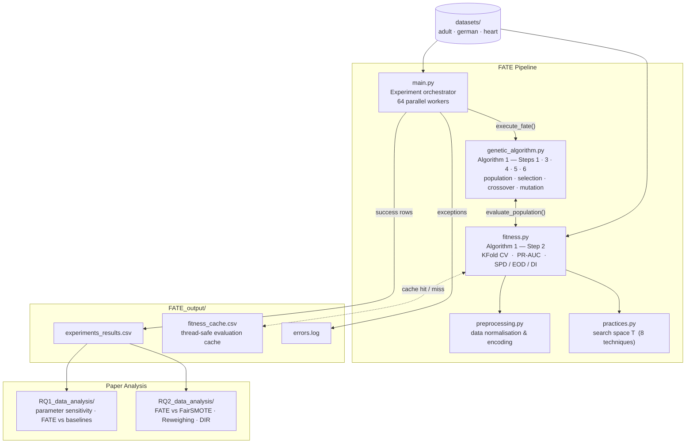

# Replication Package — Data Preparation for Fairness–Performance Trade-Offs

> **Data Preparation for Fairness–Performance Trade-Offs: A Practitioner-Friendly Alternative?**

This repository contains the full replication package for the paper above. It includes the implementation of **FATE** (Fairness-Aware Technique Evolution), a genetic-algorithm-based method that searches for the optimal sequence of fairness-aware preprocessing techniques for a given dataset and classifier, along with all datasets, experiment scripts, and analysis code needed to reproduce RQ1 and RQ2.

---

## Table of Contents

- [How FATE Works](#how-fate-works)
- [Repository Layout](#repository-layout)
- [Setup](#setup)
- [Quick Start](#quick-start)
- [Reproducing the Paper Results](#reproducing-the-paper-results)
- [Output Reference](#output-reference)
- [Code Structure](#code-structure)
- [Tests](#tests)
- [Code Quality](#code-quality)

---

## How FATE Works

FATE models data preprocessing as a search problem. An *individual* is an ordered list of preprocessing technique names (the chromosome); the GA evolves a population of such lists to maximise:

```
fitness = perf_weight × PS − fair_weight × FS
```

where **PS** = mean PR-AUC across 5-fold cross-validation and **FS** = mean `(|SPD| + |EOD| + |DI|) / 3` across the same folds. Higher fitness means better performance with less fairness deviation.

**Search space T** (8 techniques): `standard`, `stratified_sampling`, `oversampling`, `undersampling`, `clustering`, `ipw`, `matching`, `min_max_scaling`.

**Fairness metrics** (computed via AIF360, privileged = group with attribute value 1):

- **SPD** — Statistical Parity Difference
- **EOD** — Equal Opportunity Difference
- **DI** — Disparate Impact deviation (`|1 − DI_ratio|`)

---

## Repository Layout

```
.
├── datasets/                  # Input datasets
│   ├── adult.csv
│   ├── german.csv
│   └── heart.csv
│
├── FATE_output/               # Created automatically on first run
│   ├── experiments_results.csv  # One row per successful GA run
│   ├── fitness_cache.csv        # Evaluation cache (avoids redundant work)
│   └── errors.log               # Created only when errors occur
│
├── RQ1_data_analysis/         # RQ1 scripts and pre-computed results
│   ├── visualizations/          # Generated plots
│   ├── configurations_results.py
│   ├── model-dataset_results.py
│   ├── rq1_results.py
│   └── rq1_visualizations.py
│
├── RQ2_data_analysis/         # RQ2 scripts and pre-computed results
│   ├── assumptions.py
│   ├── preprocessing_experiments.py
│   └── rq2_results.py
│
├── fitness.py                 # Fitness evaluation (Step 2 of Algorithm 1)
├── genetic_algorithm.py       # Core GA (Algorithm 1, Steps 1–6)
├── practices.py               # The 8 preprocessing techniques (search space T)
├── preprocessing.py           # Dataset normalisation and feature preparation
├── main.py                    # Experiment orchestrator (parallel GA runs)
│
├── tests/                     # pytest test suite (45 tests)
│   ├── unit/
│   └── integration/
│
├── run_replication.sh         # One-command replication script
├── requirements.txt           # Runtime dependencies
├── requirements-dev.txt       # Dev dependencies (pytest, flake8, radon)
└── .flake8                    # Linter configuration
```

---

## Setup

**Python 3.10 is required.** The pipeline checks the version at startup and exits with a clear error on any other version.

```bash
# Create and activate a virtual environment
python3.10 -m venv venv
source venv/bin/activate

# Install dependencies
pip install -r requirements.txt

# Optional: dev tools (linter, tests, radon)
pip install -r requirements-dev.txt

# Make the replication script executable
chmod +x run_replication.sh
```

---

## Quick Start

Run FATE once on the Adult dataset with Logistic Regression to verify everything works and see what the algorithm finds:

```bash
./run_replication.sh --mode fast
```

Expected output (values vary across runs):

```
=== Running FATE ===
  dataset = adult
  model   = lr
  pop     = 5
  gen     = 5

============================================================
  FATE result
============================================================
  Best pipeline : ['oversampling', 'matching']
  Model         : lr
  Fitness       : 0.3421
  Performance   : 0.7183  (mean PR-AUC across 5 CV folds)
  Fairness      : 0.3762  (mean |SPD|+|EOD|+|DI| / 3)
  Elapsed       : 47.3 s
============================================================
```

**Override the defaults** from the command line:

```bash
./run_replication.sh --mode fast --dataset german --model rf --pop 10 --gen 10
```

**Use your own dataset:** edit the `CONFIGURABLE` block at the top of `run_replication.sh` to set `DEFAULT_DATASET`, `DEFAULT_MODEL`, `DEFAULT_POP`, and `DEFAULT_GEN`. To add a dataset not in the built-in catalogue, write a preparer function in [`preprocessing.py`](preprocessing.py) and register it in the `_DS_CFGS` dict inside the fast-mode Python block of the script.

> **Note:** Fast mode is designed to verify the pipeline runs correctly and explore what FATE finds — not to reproduce the exact numbers from the paper. Use `--mode full` for that.

---

## Reproducing the Paper Results

### Step 1 — Run the FATE experiment grid

The full grid covers 3 datasets × 4 classifiers × 2 protected attributes × 6 population sizes × 6 generation counts × 5 × 5 crossover/mutation rates (≈ 5 400 GA runs). Runs are parallelised with 64 worker threads.

```bash
./run_replication.sh --mode full
```

Estimated runtime: **24–48 hours** on a 64-core machine.

Restrict the grid for partial replication:

```bash
# Single dataset
./run_replication.sh --mode full --dataset adult

# Single dataset + model + fixed hyperparameters
./run_replication.sh --mode full --dataset adult --model lr --pop 50 --gen 50
```

Progress is printed after every completed task:

```
[  1/5400] ds=adult prot=sex pop=5 gen=5 a=0 b=0  ok=4 err=0
[  2/5400] ds=adult prot=sex pop=5 gen=5 a=0 b=0.25  ok=4 err=0
...
```

Alternatively, run the orchestrator directly (skips environment checks and output validation):

```bash
python main.py
```

### Step 2 — RQ1: Optimization behaviour and parameter sensitivity

Analyses how GA hyperparameters affect FATE's ability to find near-optimal pipelines, and compares FATE against two static baselines (*no practices*, *all practices*).

```bash
python RQ1_data_analysis/rq1_results.py
python RQ1_data_analysis/rq1_visualizations.py
```

Outputs: `rq1_fate_vs_baselines.csv`, sensitivity summaries, and figures saved to `RQ1_data_analysis/visualizations/`.

### Step 3 — RQ2: Comparison against state-of-the-art methods

Statistically compares FATE-selected pipelines against FairSMOTE, Reweighing, and Disparate Impact Remover using Wilcoxon signed-rank tests and Vargha–Delaney A₁₂ effect sizes.

```bash
python RQ2_data_analysis/assumptions.py        # normality checks (justifies Wilcoxon)
python RQ2_data_analysis/rq2_results.py        # hypothesis tests (H1a–H3c)
```

Outputs: `rq2_hypothesis_tests.csv` and statistical summaries.

---

## Output Reference

### `FATE_output/experiments_results.csv`

One row per successful GA run, appended incrementally (interrupting a run preserves completed rows).

| Column                  | Type  | Description                                                |
| ----------------------- | ----- | ---------------------------------------------------------- |
| `dataset`             | str   | Path to the raw CSV file                                   |
| `model_identifier`    | str   | Classifier:`lr`, `rf`, `svc`, or `xgb`             |
| `protected_attribute` | str   | Protected attribute evaluated (`sex`, `race`, `age`) |
| `population_size`     | int   | GA population size                                         |
| `generations`         | int   | Number of GA generations                                   |
| `alpha`               | float | Crossover probability                                      |
| `beta`                | float | Mutation probability                                       |
| `techniques`          | str   | Python list repr of the best technique pipeline found      |
| `model_used`          | str   | Echoes `model_identifier`                                |
| `fitness`             | float | Combined score:`perf_weight × PS − fair_weight × FS`  |
| `fairness_score`      | float | Mean of Fairness Metrics (SPD, AOD, EOD)                   |
| `performance_score`   | float | Mean PR-AUC across CV folds                                |
| `elapsed_seconds`     | float | Wall-clock time for this GA run                            |

### `FATE_output/errors.log`

Created only when errors occur. Each entry records either a worker-level exception (dataset load failure, missing column) with a full traceback, or a per-model GA failure without one. A clean run produces no file.

```
================================================================================
TIMESTAMP:  2025-01-15T14:32:07
DATASET:    adult (datasets/adult.csv)
PROTECTED:  sex
PARAMS:     pop=10 gen=5 alpha=0.5 beta=0.5
ERROR:      model=xgb: <exception message>
TRACEBACK:
  Traceback (most recent call last):
    ...
```

### `FATE_output/fitness_cache.csv`

Thread-safe CSV cache keyed on `(model, protected_attribute, target_column, techniques)`. Prevents redundant fitness evaluations across parallel GA runs. Can be safely deleted to force full recomputation.

### Approximate runtimes

| Configuration                                  | Estimated time |
| ---------------------------------------------- | -------------- |
| Fast mode default (adult / lr / pop=5 / gen=5) | 1–3 min       |
| Full grid, single dataset + model              | 4–8 hours     |
| Full grid, all datasets (64 workers)           | 24–48 hours   |

---

## Code Structure

Each module maps to a component in **Figure 4** of the paper. The diagram below shows how data and control flow through the system; the table that follows maps every box to the implementing code.

### Module Dependency Diagram



### Figure 4 Component Map

| Figure 4 Component                            | Module                                                                                            | Key function(s)                                                    |
| --------------------------------------------- | ------------------------------------------------------------------------------------------------- | ------------------------------------------------------------------ |
| Input datasets                                | `datasets/`                                                                                     | raw CSV files                                                      |
| Dataset-specific normalisation                | [`preprocessing.py`](preprocessing.py)                                                             | `prepare_adult`, `prepare_german`, `prepare_heart`           |
| Generic data preparation                      | [`preprocessing.py`](preprocessing.py)                                                             | `prepare_data_model`, `encode_and_impute`, `binarize_target` |
| Search space*T* (technique genes)           | [`practices.py`](practices.py)                                                                     | `apply_techniques`, `apply_*`                                  |
| **Step 1 — Population initialisation** | [`genetic_algorithm.py`](genetic_algorithm.py)                                                     | `_initialise_population`                                         |
| **Step 2 — Fitness evaluation**        | [`fitness.py`](fitness.py)                                                                         | `fitness` → `_run_kfold_evaluation`, `fairness_metrics`     |
| **Step 3 — Selection**                 | [`genetic_algorithm.py`](genetic_algorithm.py)                                                     | `_select_parents`                                                |
| **Step 4 — Crossover**                 | [`genetic_algorithm.py`](genetic_algorithm.py)                                                     | `_apply_crossover` (single-point, prob. α)                      |
| **Step 5 — Mutation**                  | [`genetic_algorithm.py`](genetic_algorithm.py)                                                     | `_apply_mutation` (technique replacement, prob. β)              |
| Duplicate removal                             | [`genetic_algorithm.py`](genetic_algorithm.py)                                                     | `_unique_preserve_order`                                         |
| Experiment orchestration                      | [`main.py`](main.py)                                                                               | `execute_fate`, `_run_timed_fate`, `worker_task`             |
| RQ1 — parameter sensitivity                  | [`RQ1_data_analysis/configurations_results.py`](RQ1_data_analysis/configurations_results.py)       | `summarize_group`                                                |
| RQ1 — best configuration extraction          | [`RQ1_data_analysis/model-dataset_results.py`](RQ1_data_analysis/model-dataset_results.py)         | `main`                                                           |
| RQ1 — FATE vs baselines                      | [`RQ1_data_analysis/rq1_results.py`](RQ1_data_analysis/rq1_results.py)                             | `compute_baselines`                                              |
| RQ1 — visualisations                         | [`RQ1_data_analysis/rq1_visualizations.py`](RQ1_data_analysis/rq1_visualizations.py)               | `plot_fate_vs_baselines`, `make_all_param_plots`               |
| RQ2 — baseline experiments                   | [`RQ2_data_analysis/preprocessing_experiments.py`](RQ2_data_analysis/preprocessing_experiments.py) | `run_rq2`, `run_baseline_method`                               |
| RQ2 — Wilcoxon tests & A₁₂                 | [`RQ2_data_analysis/rq2_results.py`](RQ2_data_analysis/rq2_results.py)                             | `compare_method`, `vargha_delaney_a12`                         |
| RQ2 — normality assumption checks            | [`RQ2_data_analysis/assumptions.py`](RQ2_data_analysis/assumptions.py)                             | `check_assumptions`                                              |

### Core FATE modules

**[`genetic_algorithm.py`](genetic_algorithm.py)** — Algorithm 1 end-to-end. The single public function `genetic_algorithm` runs all six steps: population initialisation, fitness evaluation, selection, crossover, mutation, and duplicate removal. Individuals are variable-length ordered lists of unique technique names drawn from the eight-element search space in `practices.py`.

**[`fitness.py`](fitness.py)** — Step 2 of Algorithm 1. Applies the technique pipeline to the data, trains the classifier under 5-fold CV, and returns the composite `fitness = perf_weight × PS − fair_weight × FS` score. Includes a thread-safe CSV cache to avoid redundant evaluations across parallel GA runs.

**[`practices.py`](practices.py)** — The search space T. Each of the eight functions (`apply_standard_transformation`, `apply_stratified_sampling`, `apply_oversampling`, `apply_undersampling`, `apply_clustering`, `apply_ipw`, `apply_matching`, `apply_min_max_scaling`) is one gene. The dispatcher `apply_techniques` is the single entry point called by `fitness()` for each token in a chromosome.

**[`preprocessing.py`](preprocessing.py)** — Two layers of data preparation: dataset-specific normalisers (`prepare_adult`, `prepare_german`, `prepare_heart`) and the generic pipeline `prepare_data_model` (one-hot encoding, median imputation, optional target binarisation).

**[`main.py`](main.py)** — Experiment orchestrator. Runs the full parameter-grid search parallelised with `ThreadPoolExecutor` (64 workers). Writes successful rows to `FATE_output/experiments_results.csv` and errors to `FATE_output/errors.log`, keeping the two cleanly separated.

### Analysis modules

**[`RQ1_data_analysis/configurations_results.py`](RQ1_data_analysis/configurations_results.py)** — Aggregates fitness/fairness/performance statistics by individual GA hyperparameter and by full configuration.

**[`RQ1_data_analysis/model-dataset_results.py`](RQ1_data_analysis/model-dataset_results.py)** — Extracts the best FATE configuration per (dataset × model × protected attribute) group; its output is the primary input for RQ2.

**[`RQ1_data_analysis/rq1_results.py`](RQ1_data_analysis/rq1_results.py)** — Evaluates the two static baselines and merges them with FATE results.

**[`RQ1_data_analysis/rq1_visualizations.py`](RQ1_data_analysis/rq1_visualizations.py)** — Generates all RQ1 figures: FATE-vs-baselines boxplots and hyperparameter sensitivity line plots.

**[`RQ2_data_analysis/preprocessing_experiments.py`](RQ2_data_analysis/preprocessing_experiments.py)** — Re-evaluates the best FATE configurations against FairSMOTE, Reweighing, and Disparate Impact Remover under 5-fold CV.

**[`RQ2_data_analysis/rq2_results.py`](RQ2_data_analysis/rq2_results.py)** — Runs Wilcoxon signed-rank tests and Vargha–Delaney A₁₂ for all nine hypotheses (H1a–H3c).

**[`RQ2_data_analysis/assumptions.py`](RQ2_data_analysis/assumptions.py)** — Shapiro–Wilk normality checks on paired differences, justifying the non-parametric Wilcoxon test.

---

## Tests

The test suite uses **pytest** and covers Algorithm 1 at two granularities:

| Directory              | What is tested                                                 |
| ---------------------- | -------------------------------------------------------------- |
| `tests/unit/`        | Individual functions with known inputs and expected outputs    |
| `tests/integration/` | The full FATE pipeline end-to-end on a small synthetic dataset |

```bash
pytest tests/          # full suite (~5 s, 45 tests)
pytest tests/unit/     # unit tests only (<3 s)
pytest tests/integration/  # integration test only (~4 s)
```

Expected result:

```
collected 45 items

tests/integration/test_fate_pipeline.py .........   [  9/45]
tests/unit/test_fairness_metrics.py  ............   [21/45]
tests/unit/test_fitness_computation.py ......        [27/45]
tests/unit/test_genetic_operators.py  ...........   [45/45]

45 passed in ~5s
```

---

## Code Quality

The project is linted with **flake8** (max line length 99, config in [`.flake8`](.flake8)):

```bash
flake8 .
```

Cyclomatic complexity is tracked with **radon** — all functions in the core modules grade A or B:

```bash
radon cc fitness.py genetic_algorithm.py main.py -s
```
