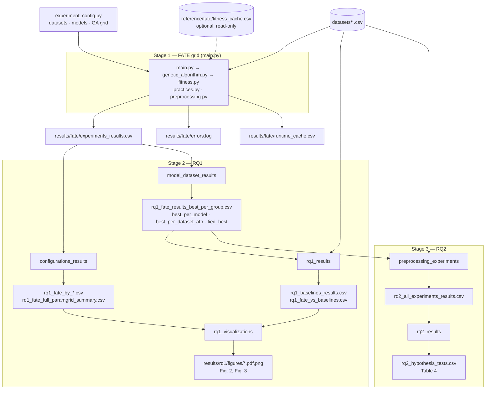

# Replication Package — Data Preparation for Fairness–Performance Trade-Offs

> **Data Preparation for Fairness–Performance Trade-Offs: A Practitioner-Friendly Alternative?**
> Empirical Software Engineering (EMSE-D-25-00975). Permanent archive: [10.5281/zenodo.21329487](https://doi.org/10.5281/zenodo.21329487).

This package contains the implementation of **FATE** (Fairness-Aware Trade-Off Enhancement), the datasets, the scripts that produce every table and figure of RQ1 and RQ2, and the archived outputs of the runs reported in the paper.

## Table of Contents

1. [Quick start](#1-quick-start)
2. [Setup](#2-setup)
3. [Replication pipeline and data flow](#3-replication-pipeline-and-data-flow)
4. [Repository contents](#4-repository-contents)
5. [Results versus reference outputs](#5-results-versus-reference-outputs)
6. [Output file reference](#6-output-file-reference)
7. [Fitness cache and numerical handling](#7-fitness-cache-and-numerical-handling)
8. [How the code maps to the paper](#8-how-the-code-maps-to-the-paper)
9. [Tests and code quality](#9-tests-and-code-quality)
10. [Use of AI assistance](#10-use-of-ai-assistance)
11. [Development history](#11-development-history)

---

## 1. Quick start

```bash
python3.10 -m venv venv && source venv/bin/activate
pip install -r requirements.txt
./run_replication.sh --mode fast                      # one GA run: installation check
./run_replication.sh --mode analysis --from-reference # RQ1 + RQ2 from the paper's archived FATE grid
./run_replication.sh --mode all --reset-cache         # complete replication from scratch
```

All commands are run from the repository root.

---

## 2. Setup

**Python 3.10 is required.** `main.py` stops with an explicit error on any other version, and `run_replication.sh` checks the version before running anything.

```bash
python3.10 -m venv venv
source venv/bin/activate
pip install -r requirements.txt        # runtime dependencies
pip install -r requirements-dev.txt    # optional: tests, coverage, linting, complexity
```

| File | Content |
| --- | --- |
| `requirements.in` | Direct runtime dependencies, with the reason for each non-obvious one. |
| `requirements.txt` | Lock file generated from `requirements.in` (`uv pip compile requirements.in --python-version 3.10 --universal -o requirements.txt`). Every transitive dependency is pinned. |
| `requirements-dev.in` / `requirements-dev.txt` | Same, plus pytest, coverage, flake8 (with flake8-annotations and pep8-naming) and radon. |

**AIF360 import notices.** On import, AIF360 probes optional back-ends (TensorFlow, inFairness/PyTorch) used only by in-processing algorithms that FATE does not use, and logs one notice per missing back-end. These multi-gigabyte packages are deliberately not installed. `aif360_setup.py` suppresses exactly these two notices and nothing else, so a notice about any other missing dependency is still shown.

---

## 3. Replication pipeline and data flow

The pipeline has three stages. Each stage reads only files produced by the previous stage (or, optionally, the archived paper outputs in `reference/`), and writes only under `results/`.



| Stage | Command (from the repo root) | Reads | Writes |
| --- | --- | --- | --- |
| 1 · FATE grid | `python main.py` (all options: `python main.py --help`) | `datasets/*.csv`; optionally `reference/fate/fitness_cache.csv` | `results/fate/experiments_results.csv`, `results/fate/errors.log` (only if a run fails), `results/fate/runtime_cache.csv` |
| 2a · RQ1 parameter sensitivity | `python -m RQ1_data_analysis.configurations_results` | `results/fate/experiments_results.csv` | `results/rq1/rq1_fate_by_{population_size,generations,alpha,beta}.csv`, `results/rq1/rq1_fate_full_paramgrid_summary.csv` |
| 2b · RQ1 best configurations | `python -m RQ1_data_analysis.model_dataset_results` | `results/fate/experiments_results.csv` | `results/rq1/rq1_fate_results_best_per_group.csv` (Table 3), `…_best_per_model.csv`, `…_best_per_dataset_attr.csv`, `…_tied_best.csv` |
| 2c · RQ1 baselines | `python -m RQ1_data_analysis.rq1_results` | `results/rq1/rq1_fate_results_best_per_group.csv`, `datasets/*.csv` | `results/rq1/rq1_baselines_results.csv`, `results/rq1/rq1_fate_vs_baselines.csv` |
| 2d · RQ1 figures | `python -m RQ1_data_analysis.rq1_visualizations` | outputs of 2a and 2c | `results/rq1/figures/` (Fig. 2 boxplots, Fig. 3 parameter plots) |
| 3a · RQ2 experiments | `python -m RQ2_data_analysis.preprocessing_experiments` | `results/rq1/rq1_fate_results_best_per_group.csv`, `datasets/*.csv` | `results/rq2/rq2_all_experiments_results.csv` (FATE re-runs + FairSMOTE, Reweighing, DIR) |
| 3b · RQ2 hypothesis tests | `python -m RQ2_data_analysis.rq2_results` | `results/rq2/rq2_all_experiments_results.csv` | `results/rq2/rq2_hypothesis_tests.csv` (Table 4) |

`run_replication.sh` chains these commands:

| Mode | Runs | Typical use |
| --- | --- | --- |
| `--mode fast` | Stage 1 with a single GA run (default `adult / lr / sex / N=5 / G=5 / α=β=0.5`; override with `--dataset`, `--model`, `--pop`, `--gen`) | Installation check |
| `--mode full` | Stage 1 on the full grid (restrict it with `--dataset`, `--model`, `--pop`, `--gen`) | Re-generating the FATE grid |
| `--mode analysis` | Stages 2 and 3 on `results/fate/experiments_results.csv` | Analyses after a grid run |
| `--mode analysis --from-reference` | Stages 2 and 3 starting from `reference/fate/experiments_results.csv` | Re-deriving RQ1/RQ2 without re-running the multi-day grid |
| `--mode all` | Stage 1 (full grid), then stages 2 and 3 | Complete replication from scratch |

Add `--reset-cache` to any mode to compute every fitness value during the run instead of reusing the archived cache (see [Section 7](#7-fitness-cache-and-numerical-handling)).

**Every stage-level script accepts explicit paths**, so any intermediate file can be regenerated in isolation, e.g. `python -m RQ2_data_analysis.rq2_results --input reference/rq2/rq2_all_experiments_results.csv --out /tmp/tests.csv`.

---

## 4. Repository contents

Every versioned file is listed below. Nothing else is needed to run the package.

| Path | Role | Produced by | Consumed by |
| --- | --- | --- | --- |
| **Code — FATE** | | | |
| `main.py` | Stage 1 orchestrator and CLI: builds the grid, runs GA runs in parallel, writes results and errors separately | – | `run_replication.sh`, RQ2 stage 3a |
| `genetic_algorithm.py` | Algorithm 1: initialisation, selection, crossover, mutation, duplicate removal | – | `main.py` |
| `fitness.py` | Fitness evaluation (Step 2 of Algorithm 1): practices, 5-fold CV, PR-AUC, SPD/EOD/DI via AIF360, fitness cache | – | `genetic_algorithm.py`, RQ1/RQ2 scripts |
| `practices.py` | The eight fairness-aware Data Preparation practices (search space *T*) | – | `fitness.py` |
| `preprocessing.py` | Dataset-specific normalisers and generic model preparation | – | all stages |
| `experiment_config.py` | Single definition of datasets, protected attributes, models, practices and GA grid (Table 2) | – | all stages |
| `paths.py` | Single definition of every input/output location | – | all stages |
| `numerics.py` | Floating-point policy: strict mode, handling of undefined fairness ratios, Accelerate BLAS ([Section 7](#7-fitness-cache-and-numerical-handling)) | – | `fitness.py`, RQ2 stage 3a |
| `aif360_setup.py` | Suppresses AIF360's notices about the two unused back-ends ([Section 2](#2-setup)) | – | `fitness.py`, RQ2 stage 3a |
| **Code — analyses** | | | |
| `RQ1_data_analysis/configurations_results.py` | Stage 2a | – | – |
| `RQ1_data_analysis/model_dataset_results.py` | Stage 2b | – | – |
| `RQ1_data_analysis/rq1_results.py` | Stage 2c | – | – |
| `RQ1_data_analysis/rq1_visualizations.py` | Stage 2d | – | – |
| `RQ2_data_analysis/preprocessing_experiments.py` | Stage 3a | – | – |
| `RQ2_data_analysis/rq2_results.py` | Stage 3b | – | – |
| `RQ1_data_analysis/__init__.py`, `RQ2_data_analysis/__init__.py`, `tests/**/__init__.py` | Package markers (empty) | – | Python |
| **Entry point and tooling** | | | |
| `run_replication.sh` | Environment check and pipeline driver ([Section 3](#3-replication-pipeline-and-data-flow)) | – | user |
| `scripts/quality_report.sh` | Regenerates the code-quality evidence ([Section 9](#9-tests-and-code-quality)) | – | user |
| `tests/`, `pytest.ini` | pytest suite (unit and integration); numerical warnings are errors | – | pytest |
| `.flake8` | Linter configuration (provided by the reviewers, used verbatim) | – | flake8 |
| `requirements*.in`, `requirements*.txt` | Dependencies ([Section 2](#2-setup)) | – | pip |
| `.gitignore`, `.gitattributes` | Git configuration (`results/` is ignored; LF line endings for code) | – | git |
| `docs/code_quality.md` | flake8 and full-codebase Radon report | `scripts/quality_report.sh` | reader |
| **Inputs** | | | |
| `datasets/adult.csv`, `datasets/german.csv`, `datasets/heart.csv` | Raw benchmark datasets (UCI) | – | all stages |
| **Archived paper outputs (read-only, [Section 5](#5-results-versus-reference-outputs))** | | | |
| `reference/fate/experiments_results.csv` | FATE grid of the paper (Stage 1 output) | Stage 1, paper run | Stage 2 with `--from-reference` |
| `reference/fate/fitness_cache.csv` | Fitness values computed during the paper's grid | Stage 1, paper run | `fitness.py` unless `--reset-cache` |
| `reference/rq1/*.csv` | RQ1 tables of the paper (Stage 2 outputs, same names as in `results/rq1/`) | Stage 2, paper run | comparison only |
| `reference/rq1/figures/*` | Figures 2 and 3 of the paper | Stage 2d, paper run | comparison only |
| `reference/rq2/rq2_all_experiments_results.csv` | RQ2 per-method results of the paper | Stage 3a, paper run | Stage 3b with `--input` |
| `reference/rq2/rq2_hypothesis_tests.csv` | Table 4 of the paper | Stage 3b, paper run | comparison only |
| `reference/rq2/rq2_experiments_cache.csv` | Fitness cache of the FATE runs of the paper's RQ2 experiment, kept for provenance | Stage 3a, paper run | not read by any script |
| **Generated at run time (not versioned)** | | | |
| `results/fate/`, `results/rq1/`, `results/rq2/` | Outputs of the current run ([Section 6](#6-output-file-reference)) | Stages 1–3 | next stage |

---

## 5. Results versus reference outputs

- **`results/`** holds everything produced by *your* run. It does not exist in a fresh clone and is git-ignored, so a replication always starts empty.
- **`reference/`** holds the outputs of the runs reported in the paper. No script writes to it. It mirrors the structure of `results/` (same file names), so the two can be compared file by file.

Using the reference grid, stages 2–3 reproduce the archived analyses exactly:

| Regenerated from `reference/` | Compared with | Outcome |
| --- | --- | --- |
| `rq1_fate_by_*.csv`, `rq1_fate_full_paramgrid_summary.csv` | `reference/rq1/` | Identical |
| `rq2_hypothesis_tests.csv` (from `reference/rq2/rq2_all_experiments_results.csv`) | `reference/rq2/rq2_hypothesis_tests.csv` | Identical in every column of the archived file; the regenerated file adds the symmetry check, the sign test and the Holm-adjusted p-values (Section 6) |
| `rq1_fate_results_best_per_group.csv` | `reference/rq1/` (Table 3) | Identical fitness, FS, PS and pipelines for all 24 groups. See the note on ties below. |

**Ties in Table 3.** Many GA configurations reach the same best pipeline, and therefore the same fitness, FS and PS. Stage 2b keeps the first tied configuration in file order and also writes *all* tied configurations to `rq1_fate_results_tied_best.csv`. Every configuration reported in the paper appears in that file.

**Re-running FATE.** The genetic algorithm is stochastic and not seeded, so a new Stage 1 run (or the FATE re-runs in Stage 3a) is a new execution of the search, and its values are not expected to coincide with those in `reference/`. The numbers in the paper are those in `reference/`.

---

## 6. Output file reference

### `results/fate/experiments_results.csv` (Stage 1)

One row per successful GA run, appended as soon as the run completes (an interruption keeps completed rows).

| Column | Type | Description |
| --- | --- | --- |
| `dataset` | str | Path of the raw dataset |
| `model_identifier` | str | `lr`, `rf`, `svc` or `xgb` |
| `protected_attribute` | str | `sex`, `race` or `age` |
| `population_size`, `generations` | int | GA parameters N and G |
| `alpha`, `beta` | float | Crossover and mutation rates |
| `techniques` | str | Best pipeline found (Python list) |
| `model_used` | str | Echoes `model_identifier` |
| `fitness` | float | `0.5 × PS − 0.5 × FS`; `-inf` if the run found no feasible pipeline ([Section 7.2](#72-undefined-fairness-values)) |
| `fairness_score` | float | FS = mean over folds of (\|SPD\| + \|EOD\| + \|1 − DI\|) / 3 |
| `performance_score` | float | PS = mean PR-AUC over the 5 folds |
| `elapsed_seconds` | float | Wall-clock time of the GA run |

### `results/fate/errors.log` (Stage 1)

Created only if a run fails. Each entry records the timestamp, dataset, protected attribute, GA parameters, error message and, for worker-level failures, the full traceback. Failed runs never appear in the results CSV.

### `results/rq2/rq2_all_experiments_results.csv` (Stage 3a)

One row per (dataset, protected attribute, model, method), with `method` ∈ {FATE, FairSMOTE, Reweighing, DIR} and columns `performance_score`, `fairness_score`, `elapsed_seconds`, `undefined_fairness_folds` (baselines: folds in which a fairness metric is undefined), `fairness_undefined` (baselines: FS undefined and set to 1.0, [Section 7.2](#72-undefined-fairness-values)), `error`.

### `results/rq2/rq2_hypothesis_tests.csv` (Stage 3b, Table 4)

One row per hypothesis H1a–H3c. Each hypothesis compares FATE and one baseline on one metric over the 24 paired configurations (dataset, protected attribute, model).

| Column | Description |
| --- | --- |
| `hypothesis`, `metric`, `direction`, `baseline`, `n_pairs` | Identification of the comparison; `direction` is `lower` or `higher` is better |
| `fate_mean`, `baseline_mean` | Means of the metric |
| `p_value` | Two-sided exact Wilcoxon signed-rank test on the paired differences (FATE − baseline) |
| `p_holm` | `p_value` adjusted with the Holm–Bonferroni procedure over the nine hypotheses |
| `symmetry_stat`, `symmetry_p`, `symmetric_0.05` | Miao–Gel–Gastwirth test of symmetry of the paired differences (assumption of the Wilcoxon signed-rank test); p-value from a symmetrised bootstrap with 10,000 replicates and a fixed seed |
| `sign_p`, `sign_p_holm` | Exact sign test on the paired differences (no symmetry assumption), unadjusted and Holm-adjusted |
| `a12_raw`, `a12_effective` | Vargha–Delaney A₁₂; `a12_effective > 0.5` always favours FATE |
| `significant_holm_0.05`, `sign_significant_holm_0.05` | Decisions at α = 0.05 on the Holm-adjusted p-values |
| `who_is_better` | `FATE_better`, `Baseline_better` or `No_diff`, from `significant_holm_0.05` and `a12_effective` |
| `conclusion_robust` | True if the Wilcoxon and the sign test lead to the same decision |

---

## 7. Fitness cache and numerical handling

### 7.1 Floating-point policy

NumPy's default is to *warn* about invalid floating-point operations (division by zero, overflow, invalid values) and to continue with `inf`/`NaN`. The package does not rely on this default (`numerics.py`):

- **Strict mode.** Every fitness evaluation (`fitness.py`) and every RQ2 baseline evaluation runs under `np.errstate(all='raise')`: an invalid operation raises `FloatingPointError` instead of producing a corrupt value. The error state is set per evaluation, because it is thread-local and `main.py` evaluates in worker threads.
- **Type-specific exception handling.** Exceptions are no longer caught broadly. A practice or a classifier that fails is not skipped: the error propagates. In `main.py`, a GA run that fails with a numerical error (`FloatingPointError`, `NonFiniteResultError`) or a data error (`ValueError`) is recorded in `results/fate/errors.log` with its traceback and never written to the results CSV; any other exception stops the grid.
- **Output checks.** Features after Data Preparation, classifier scores, performance scores and Reweighing weights are checked to be finite (`require_finite`).
- **Tests.** `pytest.ini` turns every `RuntimeWarning` into an error, so a test that triggers a numerical warning fails.

**Warnings on Apple-silicon Macs.** On these machines, NumPy ≥ 2.0 uses Apple's Accelerate BLAS, which raises spurious *divide by zero*, *overflow* and *invalid value* flags on valid matrix products, e.g. in `sklearn/utils/extmath.py` (`ret = a @ b`). This is a known issue of Accelerate ([numpy/numpy#28687](https://github.com/numpy/numpy/issues/28687)); it is fixed in NumPy 2.3, which requires Python ≥ 3.11 and is therefore not usable with the pinned environment. Because the flags are unreliable on Accelerate, strict mode would abort valid computations there. On that back-end only, the Data Preparation practices and the model training/prediction run with the flags ignored, and their outputs are validated with `require_finite` instead. On all other back-ends (OpenBLAS: Linux, Windows, Intel macOS) these steps are strict as well. The active back-end is reported by `python -c "import numerics; print(numerics.blas_backend())"`.

### 7.2 Undefined fairness values

SPD, EOD and DI are differences and ratios of group rates. In a test fold where a group receives no positive prediction (or has no positive instance), a rate or ratio is undefined: 0/0, or x/0 for DI. This is a property of the fold and of the classifier's predictions, not a numerical error. These ratios are the only operations evaluated with relaxed checks, and their outcome is handled explicitly:

| Case | FATE fitness (`fitness.py`) | RQ2 baselines (`preprocessing_experiments.py`) |
| --- | --- | --- |
| A metric is 0/0 in a fold | The fold has no defined fairness and is excluded from FS | The metric is averaged over the folds where it is defined (`undefined_fairness_folds`) |
| DI is x/0 (unbounded disparity) in a fold | The pipeline is infeasible | FS is undefined |
| No fold with defined fairness / a metric undefined in every fold | The pipeline is infeasible | FS is undefined |
| Empty or single-class target, no evaluable fold | The pipeline is infeasible | – |

An **infeasible** pipeline receives fitness `-inf` (`fitness.INFEASIBLE`): it ranks below every feasible pipeline, and `NaN` never reaches the ranking of the GA. A GA run whose best pipeline is infeasible is written to the results with fitness `-inf`, and the RQ1 parameter-sensitivity summaries (stage 2a) exclude it and print the number of excluded runs. An **undefined FS of a baseline** (the mitigated classifier never predicts the favourable outcome for a group) is set to 1.0, the maximum of the normalised FS scale, and flagged in `fairness_undefined`.

### 7.3 Fitness cache

`fitness.py` caches fitness values keyed on (model, protected attribute, target, **ordered** list of practices). Practices are applied in sequence and the order changes the resulting dataset, so a cached value is reused only for the identical pipeline.

| Cache | Location | Read | Written |
| --- | --- | --- | --- |
| Runtime cache | `results/fate/runtime_cache.csv` | always | by every new evaluation |
| Archived cache | `reference/fate/fitness_cache.csv` | unless `--reset-cache` | never |

- **From scratch:** pass `--reset-cache` (to `run_replication.sh`, `main.py` or stage 3a). The archived cache is ignored and every fitness value is computed during the run.
- **Clearing the runtime cache:** delete `results/fate/runtime_cache.csv`, or the whole `results/` folder. The archived cache is never modified.
- **Stability of the regeneration.** A fitness evaluation is deterministic (fixed seeds for the cross-validation split, the classifiers and the practices), so regenerating the cache from scratch yields identical values, and it runs in strict floating-point mode. A cache file with a malformed value raises an error instead of being silently ignored; a `NaN` fitness written by earlier versions of the code is read as infeasible.

---

## 8. How the code maps to the paper

| Paper element | Module | Function(s) |
| --- | --- | --- |
| Algorithm 1, Step 1 — population initialisation | `genetic_algorithm.py` | `_initialise_population` |
| Algorithm 1, Step 2 — fitness evaluation | `fitness.py` | `fitness` → `_run_kfold_evaluation`, `fairness_metrics`, `_compute_combined_fitness` |
| Algorithm 1, Step 3 — selection | `genetic_algorithm.py` | `_select_parents` |
| Algorithm 1, Step 4 — crossover | `genetic_algorithm.py` | `_apply_crossover` |
| Algorithm 1, Step 5 — mutation | `genetic_algorithm.py` | `_apply_mutation` |
| Duplicate-practice removal | `genetic_algorithm.py` | `_unique_preserve_order` |
| Algorithm 1 (end to end) | `genetic_algorithm.py` | `genetic_algorithm` |
| Search space *T* (Section 4.2.1) | `practices.py`, `experiment_config.py` | `apply_*`, `apply_techniques`, `TECHNIQUES` |
| Table 1 — metrics | `fitness.py` | `fairness_metrics`, `_score_fold_performance`, `_compute_combined_fitness` |
| Table 2 — experimental setup | `experiment_config.py` | `DATASETS`, `MODELS`, `POPULATION_SIZES`, `GENERATION_COUNTS`, `RATES` |
| Table 3 — best configurations | `RQ1_data_analysis/model_dataset_results.py` | `main` |
| Fig. 2 — FATE vs baselines | `RQ1_data_analysis/rq1_results.py`, `rq1_visualizations.py` | `compute_baselines`, `plot_fate_vs_baselines` |
| Fig. 3 — GA parameter effects | `RQ1_data_analysis/configurations_results.py`, `rq1_visualizations.py` | `summarize_group`, `make_all_param_plots` |
| RQ2 baselines (Section 4.2.4) | `RQ2_data_analysis/preprocessing_experiments.py` | `run_rq2`, `run_baseline_method` |
| Table 4 — hypothesis tests | `RQ2_data_analysis/rq2_results.py` | `run_tests` → `compare_method` (`wilcoxon`, `symmetry_test`, `sign_test`, `vargha_delaney_a12`), `holm_adjust` |

---

## 9. Tests and code quality

```bash
pip install -r requirements-dev.txt
pytest                         # unit and integration tests
flake8 .                       # linter, configuration in .flake8
radon cc -s -a .               # cyclomatic complexity of the whole codebase
./scripts/quality_report.sh    # all of the above, including branch coverage
```

- **Linter.** `.flake8` is the configuration provided by the reviewers, used verbatim: line length 100, maximum complexity 10, naming conventions (pep8-naming) and type annotations (flake8-annotations). The codebase passes it with no warnings; every function and method is type-annotated.
- **Complexity.** Radon is applied to every module, including the RQ1/RQ2 scripts and the tests. The full per-function report is in `docs/code_quality.md`.
- **Test isolation.** Tests use a temporary fitness cache and never write to `results/`.
- **Numerical warnings.** `pytest.ini` promotes every `RuntimeWarning` to an error, so the suite passes only if no test triggers a division by zero, overflow or invalid value ([Section 7.1](#71-floating-point-policy)).

---

## 10. Use of AI assistance

<!-- AUTHORS: confirm/complete before release -->
The FATE algorithm, the experimental design and the original experiment code used to produce the results reported in the paper were written by the authors. AI coding assistants were used during the two revision rounds of the replication package, with every change reviewed by the authors, who take full responsibility for the code:

- **First revision:** Claude Code (Anthropic) assisted with docstrings, refactoring for lower cyclomatic complexity, the pytest suite, linting fixes and `run_replication.sh`.
- **Second revision:** Claude (Anthropic) assisted with the dependency lock files, the output-folder reorganisation, the linter-driven type annotations and refactorings, and this README. The commit of the second revision lists these changes grouped by reviewer comment.

No other AI tools were used. The `.cursorignore` / `.cursorindexingignore` entries in `.gitignore` come from GitHub's standard Python `.gitignore` template.

---

## 11. Development history

<!-- AUTHORS: confirm/complete before release -->
The changes made in each review round are committed separately in the [GitHub repository](https://github.com/gianwario/FATE), with a commit message that lists the changes by reviewer comment (e.g. `R3-C1`). The permanent Zenodo archive corresponds to the tagged release accompanying the paper.
